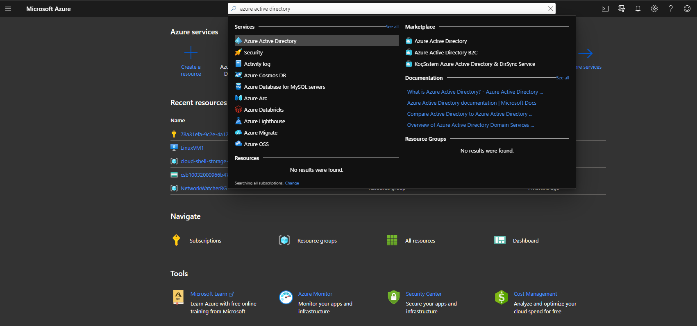
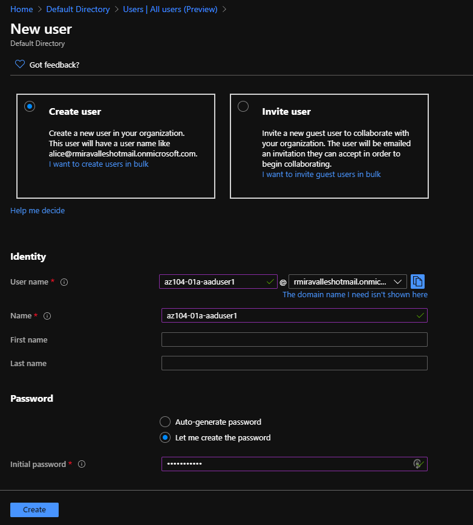
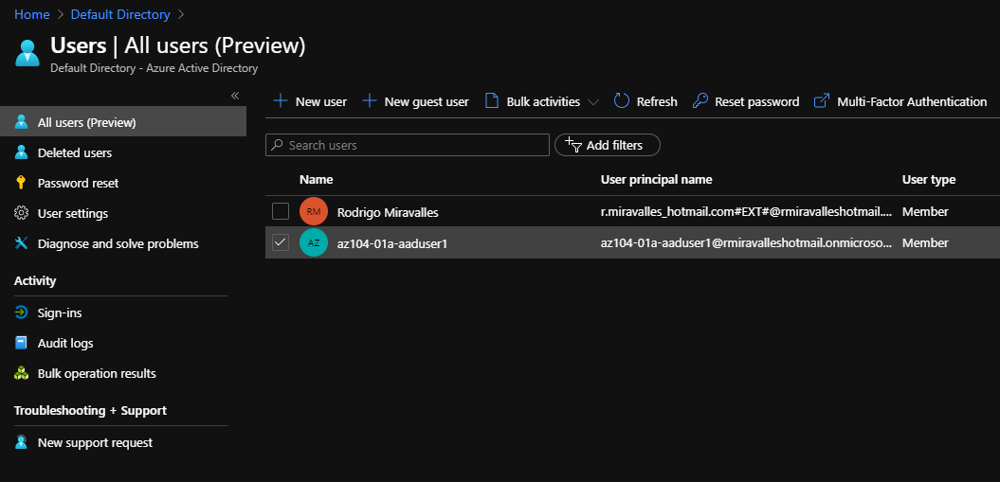
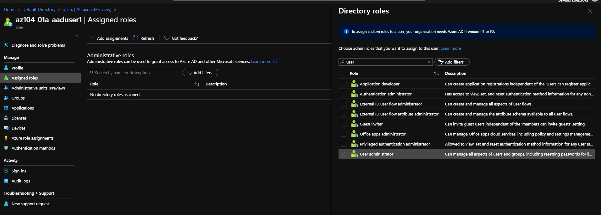
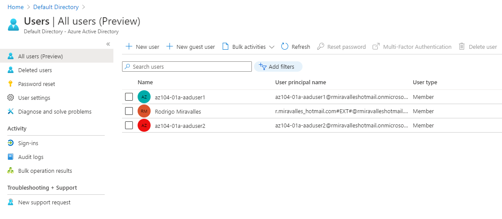

# Creating and configuring users in Azure Active Directory

## Introduction

For my studies to pass AZ-104, I'm going to follow the order of topics as they appear in the skills measured document. Identity and governance is the first topic.

## Prerequisite

For this lab, you should have an active Azure subscription and have a rough idea on how to navigate through the Azure portal. You should have a basic understanding of what Azure Active Directory is.

## Use Case

- 🖼️ (Show-Me) Create an graphic or diagram that illustrate the use-case of how this knowledge could be applied to real-world project
- ✍️ (Show-Me) Explain in one or two sentences the use case

## Cloud Research

- ✍️ Document your trial and errors. Share what you tried to learn and understand about the cloud topic or while completing micro-project.
- 🖼️ Show as many screenshot as possible so others can experience in your cloud research.

## Try yourself

✍️ Add a mini tutorial to encourage the reader to get started learning something new about the cloud.

### Step 1 — Finding Azure Active Directory

In the Azure Portal, search for Azure Active Directory using the search field on the top of the screen.

### Step 2 — Creating a user

To add a new user to the current tenant, click on **Users**, under **Manage**, on the menu on the left. Then on the top menu, click on **+ New user**. It should look like this:

I used the info provided by Microsoft Learning, but you can choose any username you like. For the password, you can let the Portal create one for you, or you can create your own. If you want to follow along, under Job title, type Cloud Administrator, and under Department, IT. This information will be used later on.

We can now see the new user.

### Step 3 — Managing the user's roles

Click on the user's name. You'll be taken to the user's menu. On the menu on the left, under **Manage**, you can go to **Profile**, click on **Edit**, and edit the user's information. Click on **Assigned Roles**, and then, on the top, **+ Add assignments**. This is done so the user can have the proper permissions to access and manage resources. In this case, we'll add the User Administrator role. This role will allow the user to create and manage all aspects of users and groups, manage support tickets, monitor service health, change passwords for users, Helpdesk admins, and other user admins.

### Step 4 — Logging in with the new user

Now, let's open a private browser window and navigate to the Azure Portal. We'll log in using the newly created user account. Once inside, we'll search for Azure Active Directory. We'll create a new user, just like we did before. We'll give this new user a unique name, create a password, and define the Job title as System Administrator and Department as IT. We'll see now 3 users: our own, and the 2 newly created users.

## ☁️ Cloud Outcome

With this lab, we learned how to create new users in Azure Active Directory, and how to assign them roles. There are many different roles, with different privileges. Role-based access control (RBAC) is a very important topic to understand, but it can be challenging. I want to cover RBAC on a later day. Stay tuned!

## Next Steps

For the next steps, we'll continue with Azure Active Directory. We'll create groups and assign them with the two different types of membership: assigned and dynamic.

## Social Proof

[Tweet](https://twitter.com/r_miravalles/status/1294700641990967296)

[LinkedIn](https://www.linkedin.com/feed/update/urn:li:activity:6700467128044146688/)
