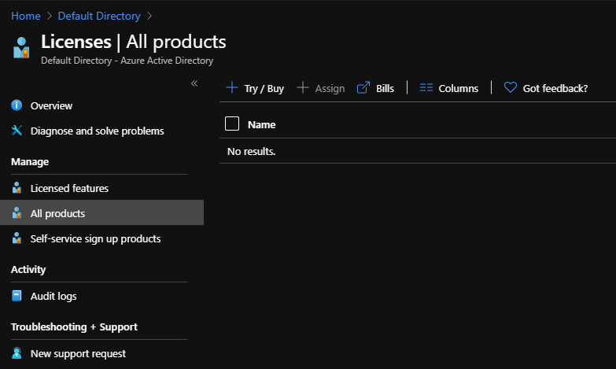
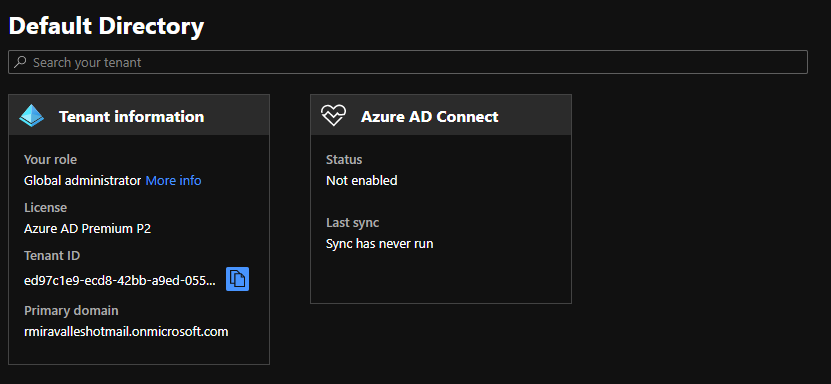
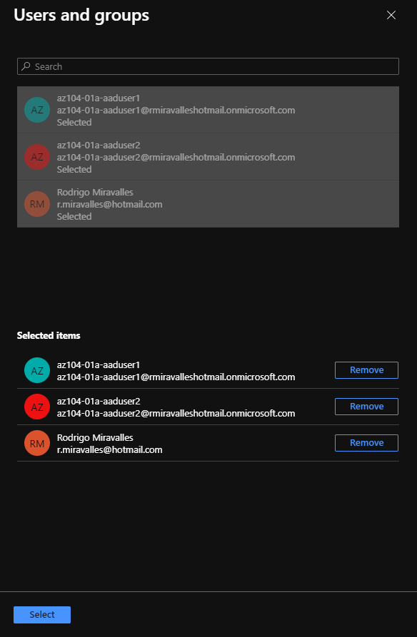
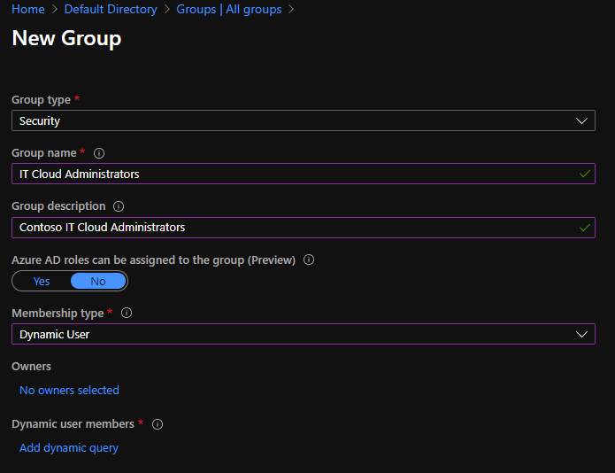
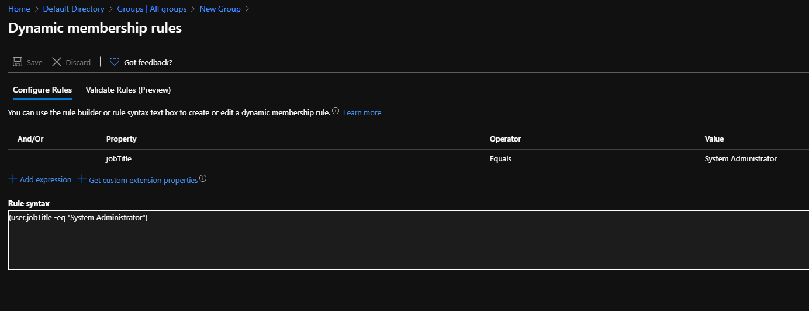
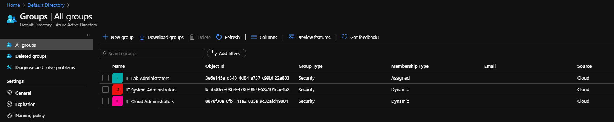
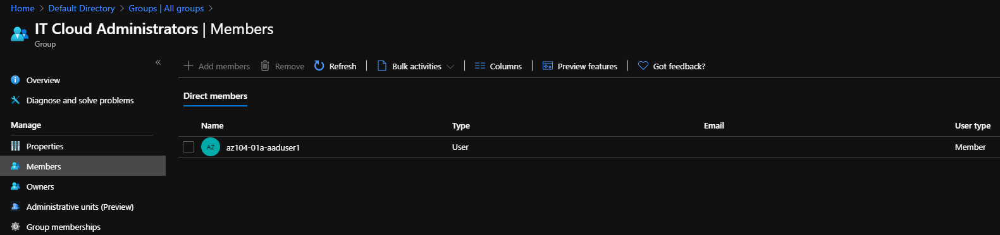
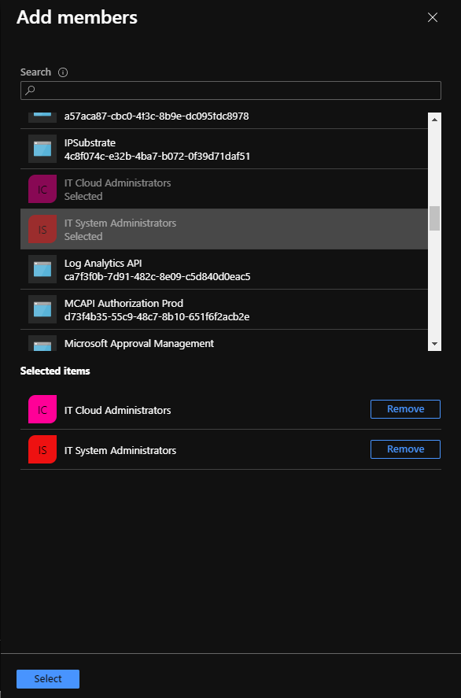

# Creating groups in Azure AD

## Introduction

This is my ongoing preparation for the AZ-104 exam. In this project, we'll create groups in Azure Active Directory with assigned and dynamic membership. For this project, Azure AD Premium P1 or P2 licenses are required. More on this later.

## Prerequisite

For this lab, you'll need an active Azure subscription, and a basic understanding of how to navigate the Azure Portal.

## Use Case

- In the real world, you, as an administrator, will use this a lot. You can use groups to assign licenses to large numbers of users or to assign access to enterprise apps. You can use **dynamic groups** to add or remove group members automatically, adding flexibility and reducing work.

## Cloud Research

- For this project, I tried to research as much as I can on Azure Active Directory and its uses. I still have to research more about the costs and differences between Azure AD licenses.

## Try yourself

### Step 1 — Upgrading the Azure AD license
Navigate to the Azure Active Directory page. Under **Manage**, on the menu on the left, click on **Licenses**. Then, under **Manage** again, click on **All products**. Click on + Try/Buy on the top menu, and Activate the free trial of Azure AD Premium P2. Refresh the browser window to see the change. It might take a couple of minutes for you to actually see the new license.

### Step 2 — Assigning licenses to users
Under **Licenses | All products**, click on **Azure Active Directory Premium P2**. Under **Licensed users**, click **+ Assign** on the top menu. Select Users and groups, and then select all the 2 users created in the previous project and your own user. I still had the users created from yesterday. I don't know if you still do, if you're following along.

### Step 3 — Creating a new group
Now, let's navigate back to the Azure Active Directory tenant blade, and click on **Groups**. Click on + New group on the top menu, and let's create a group with the following characteristics, as shown in the screenshot.

### Step 4 — Adding dynamic membership rules

Since we chose Dynamic User under Membership type, we can define membership rules. These will define who will join the group, and it's done automatically. In our case, any user with the job title of System Administrator will be automatically added to the group.

In fact, I forgot to take some screenshots. Besides the IT Cloud Administrators group you can see up here, I had created another one, named IT System Administrators. For the System Administrators group, I created the membership rule you can see on the above screenshot. For the Cloud Administrators group, a created a rule that said job title equals Cloud Administrator. These are all the groups I created. The IT LAb Administrators is different. I'll explain it on the next step. Still in the groups menu, if you click on the IT Cloud Administrators, and then members, you'll see that the user with job title Cloud Administrator has been automatically added to the group.

### Step 5 — Adding members to groups with assigned membership
Now, we'll create a new group, the one mentioned in the previous step, IT Lab Administrators. For **Membership type**, now we'll choose **Assigned**. We'll then click on **No members selected**. Now we can choose the users we want to be part of this group. We can choose groups too. Like that, all the members of the chosen group will also be members of this new group. That's what I did here.

## ☁️ Cloud Outcome

I mentioned how I love Azure Active Directory. I had fun going through this project. I hope you enjoy it too. You can see how useful the dynamic membership feature is. 

## Next Steps

For the next steps, we'll stick to AAD, and create a new Azure Active Directory tenant. I also want to go back to the licenses thing. I'll study thoroughly the differences between the licenses and post my findings here. But not tomorrow.  :)

## Social Proof

[Tweet](https://twitter.com/r_miravalles/status/1295089417561026560)
[LinkedIn](https://www.linkedin.com/feed/update/urn:li:activity:6700855735321956352/)
