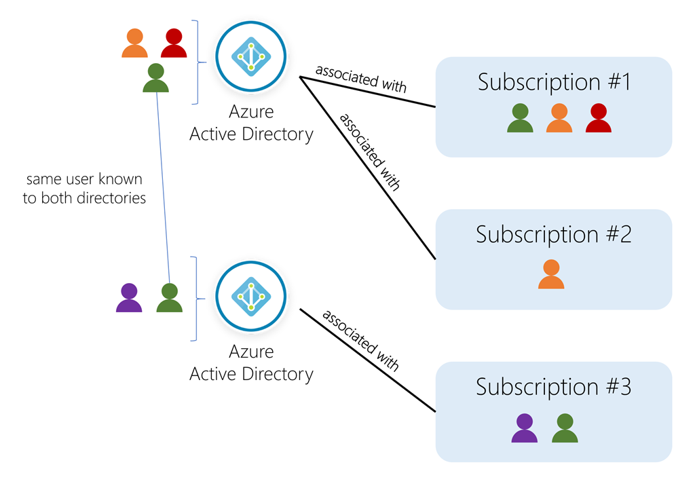

<!-- This template removes the micro tutorial for a quicker post and removes images for a full template check out the 000-DAY-ARTICLE-LONG-TEMPLATE.MD-->

# Azure AD subscriptions, tenants, users and groups

## Introduction

I have struggled a lot to wrap my mind around the basic concepts of Azure Active Directory. This short study session is just to go over, once again, these concepts.

## Use Case

- In the real world, a good understanding of what tenants and subscriptions are is essential.

## Cloud Research

- Azure Active Directory is used to identify users and control access by many cloud-based offerings, not just Azure itself. When a company, an organization, or even a single user signs up to use one of these cloud-based offerings, they are assigned a default directory, sometimes referred to as tenant. This tenant will hold the users and groups that will be allowed to access the services the company has signed up for. It is similar to a forest in Active Directory. A tenant represents the organization. An organization (tenant) always has one default Azure AD directory it's associated with, however owners can create additional directories to support development or testing purposes, or because they want to have separate directories to synchronize with their local Windows Server AD forests.
- Subscriptions in Azure are both a billing entity and a security boundary. Resources such as virtual machines, web sites, and databases are always associated to a single subscription. Each subscription also has a single account owner who is responsible for any charges incurred by resources in that subscription. A given subscription is also associated to a single Azure AD directory. Multiple subscriptions can trust the same directory, but a subscription can only trust one directory.
- Users and groups can be added to multiple subscriptions - this allows the user to create, control, and access resources in the subscription. When you add a user to a subscription, the user must be known to the associated directory as shown in the following image.

This image taken from the Microsoft Docs site might make it easier to understand.

## Social Proof

[Tweet](https://twitter.com/r_miravalles/status/1295458853677600770)
[LinkedIn](https://www.linkedin.com/feed/update/urn:li:activity:6701224918249435137/)