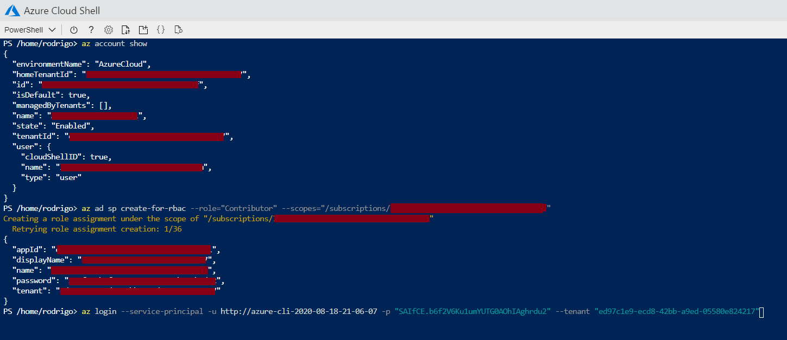
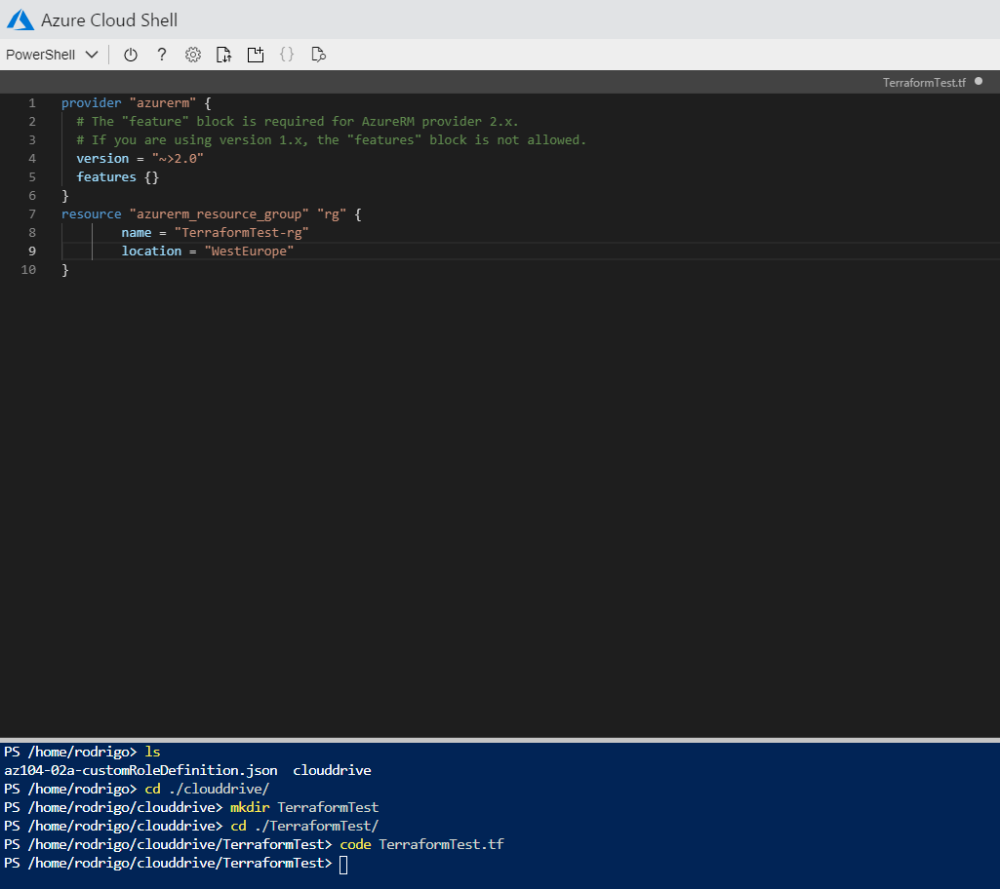
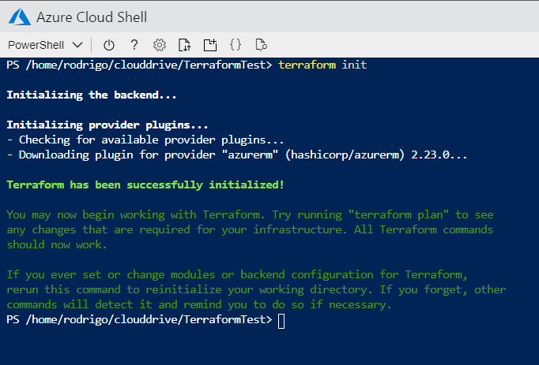
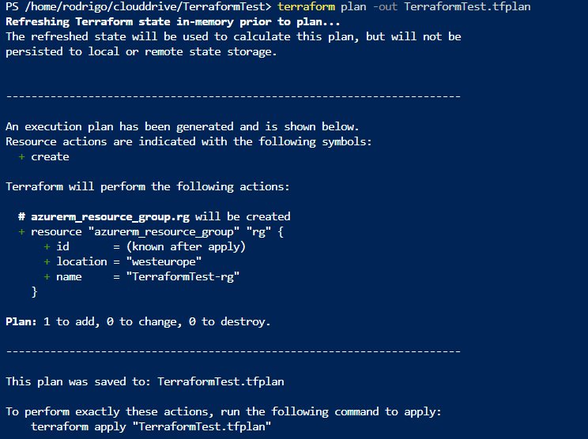
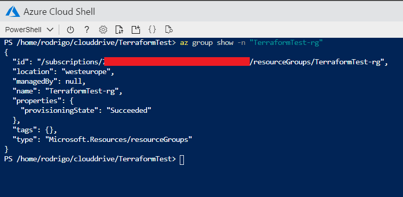
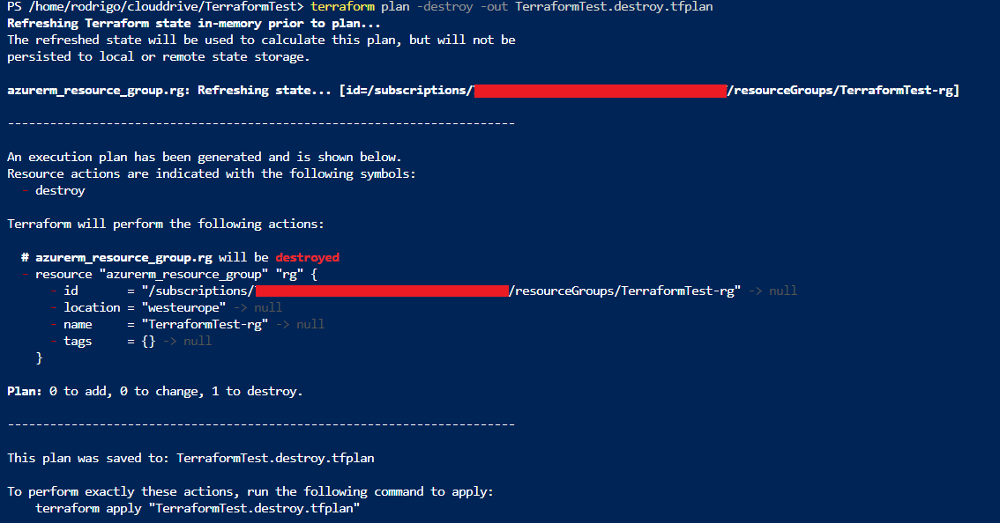

# My first look at Terraform

## Introduction

I've always wanted to learn Terraform. I find it one of the most useful tools today. This is my first attempt to deploy resources using Terraform from the Azure Cloud Shell.

## Prerequisite

If you use the Azure Cloud Shell, you don't need to install Terraform. If it's the first time you access the Cloud Shell, you'll have to setup a storage account. Don't worry, it costs you almost nothing.

## Use Case

I'm a newcomer to the game, but it seems to me that Terraform is widely used. I believe it's a tool we should know.

## Cloud Research

- I've started the Terraform on Azure course from Cloudskills and read some docs from Microsoft before actually trying this project.

## Try yourself

For this project, I created a service principal. A service principal is a special identity created for use with applications, services and tools to communicate with Azure resources. You can restrict access by configuring the service principal. This is something I need to study more in depth. I then created a resource group using Terraform and later destroyed it.

### Step 1 — Setting the service principal
Login to Azure Cloud Shell. As mentioned, tools that deploy to or use Azure services should have restricted permissions. For that, we use service principals. We can create a service principal, if we don't yet have one. When logged to the Azure Cloud Shell with our regular credentials, we run this command to create a service principal:

`<az ad sp create-for-rbac --role="Contributor" --scopes="/subscriptions/<subscription_id>">`

Contributor is the default role for a service principal. It has full permissions to read and write to an Azure account. Where it says subscription id, you should put your own. You can find it by running this command:

`<az account show>`

Now, under type, you'll see servicePrincipal instead of user. Next time, if you want to login as service principal, you'll run this command:

`<az login --service-principal -u <service_principal_name> -p "<service_principal_password>" --tenant "<service_principal_tenant>">

You'll replace the info between brackets with your own, obtained with the previous command. Keep the password, as there's no way to reset it.

### Step 2 — Terraform configuration file

Now we'll create our first Terraform configuration file. A configuration file states what needs to be done and built, and what's the state you wish to achieve. It all starts with the provider block. In our case, the provider is azure. As we know, Terraform can work with different providers. In this case, I started very simple. The configuration file is just asking Azure to create a resource group named **TerraformTest-rg**. This Terraform configuration was created inside the clouddrive. I created a new folder in there, as you can see from the screenshot.

More on provider version and configuration files later.

### Step 3 — Terraform execution plan
To initialize our deployment, we run terraform init.

`<terraform init>`

This will connect to Azure and download the modules needed to create the resources that are in the configuration file. In our case, just the resource group.

We then run terraform plan to create an execution plan based on our configuration file. This will not yet execute the plan, it will just determine what action are necessary to create the configuration we specified. The -out parameter will create an output file for the plan. We can review this file before applying the execution plan. To apply the plan, we run terraform apply.

`<terraform plan -out TerraformTest.tfplan>`

`<terraform apply TerraformTest.tfplan>`

We can now see that our resource group was successfully created! The provisioning state says succeeded.

### Step 4 — Cleaning up and destroying

We use the same **terraform** plan command to destroy the resources indicated in the configuration file. We just need to add the **-destroy** flag.

`<terraform plan -destroy -out TerraformTest.destroy.tfplan>`

Again, this command will just create an execution plan. We already know what the **-out** parameter does. We then rum terraform apply calling out the file created in the previous command.

`<terraform apply TerraformTest.destroy.tfplan>`

## ☁️ Cloud Outcome

I had fun learning this. I think I'm in love with Terraform. This is a tool I might dedicate a lot of my time to master.

## Next Steps

My plan now is to finish the course from CloudSkills and practice as much as I can.

## Social Proof

[Tweet](https://twitter.com/r_miravalles/status/1296120011682189316)
[LinkedIn](https://www.linkedin.com/feed/update/urn:li:activity:6701886131526492160/)
