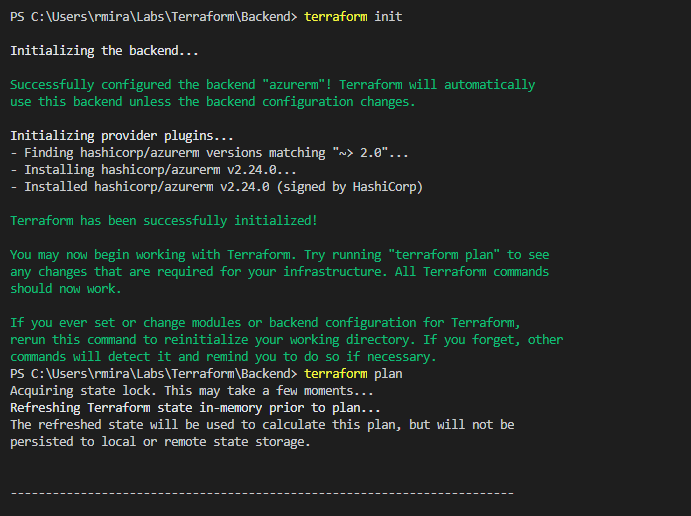
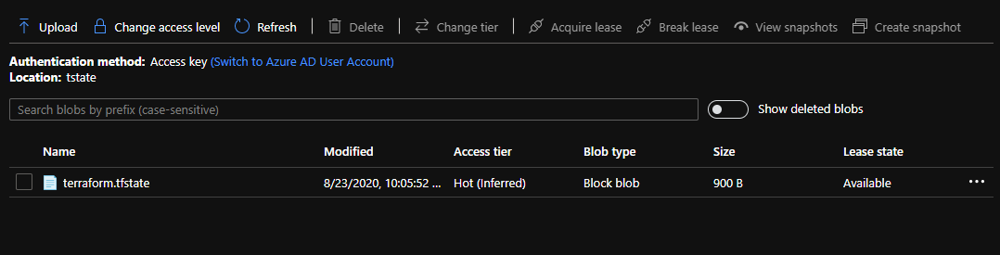
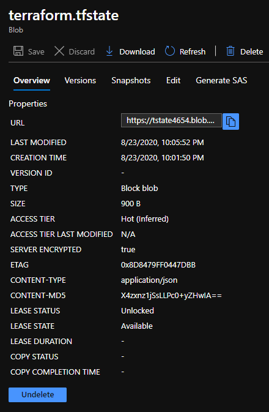

# Storing Terraform state in Azure storage

## Introduction

I hit some roadblocks during this project. I asked around in the Discord group, and received a lot of help. It took me some time to figure this one out. The idea is to use Azure Storage Account as a back end to store Terraform state files. When you run terraform apply, a state file is created. This file contains information about your deployments. By default, this state file is created in the same folder where the configuration files reside. But there's a way to send this file elsewhere, up there in the cloud.

## Prerequisite

You should have a basic understanding of Terraform, and the Azure CLI.

## Use Case

- In the real world it would be wise to store Terraform's state files in a secure pleace, since they may contain sensitive data.

## Cloud Research

- I did a lot of research on this one. I'm enjoying working with Terraform very much. Hashicorp's website is full of resources, and Microsoft Docs too.

## Try yourself

### Step 1 — Configuring the storage account
We can create variables that represent certain parameters of our resources.

`<RESOURCE_GROUP_NAME=tstate>`

`<STORAGE_ACCOUNT_NAME=tstate$RANDOM>`

`<CONTAINER_NAME=TSTATE>`

Then we run these to create a resource group, a storage account, to get a storage account key, and to create a blob container.

`<az group create --name $RESOURCE_GROUP_NAME --location westeurope>`

`<az storage account create --resource-group $RESOURCE_GROUP_NAME --name $STORAGE_ACCOUNT_NAME --sku Standard_LRS --encryption-services blob>`

`<ACCOUNT_KEY=$(az storage account keys list --resource-group $RESOURCE_GROUP_NAME --account-name $STORAGE_ACCOUNT_NAME --query [0].value -o tsv)>`

`<az storage container create --name $CONTAINER_NAME --account-name $STORAGE_ACCOUNT_NAME --account-key $ACCOUNT_KEY>`

We're gonna need the names of the storage account, the container and the storage access key for later. We can *echo* them.

`<echo "storage_account_name: $STORAGE_ACCOUNT_NAME">`

`<echo "container_name: $CONTAINER_NAME">`

`<echo "access_key: $ACCOUNT_KEY">`

### Step 2 — Environment variable and Azure Key Vault
Microsoft recommends we use an environment variable for the *access_key* value. It prevents the actual key to be written to file. Like that

`<export ARM_ACCESS_KEY=<storage access key>>`

For further protection, it's recommended that we store this key in Azure Key Vault. To store the access key in Azure Key Vault, we run this command:

`<export ARM_ACCESS_KEY=$(az keyvault secret show --name terraform-backend-key --vault-name myKeyVault --query value -o tsv)>`

I ran this and it gave me an error. Maybe that's because I had tried the other export command before. I don't know. I was stupid and didn't take a screenshot. It said something like 404 error, could not be found. Could anybody shed some light on this?

### Step 3 — Configuring the state back end
Here's where I got confused. The Terraform configuration file actually stays in our local environment, or wherever we want to keep it. The state file that goes up in the cloud. The state file contains the sensitive data, but so does the configuration file. So you'd better keep everything safe.

When we run terraform init, the state back end is configured and stored in the blob.

This is the Terraform file i ran. 

After running terraform plan, you can see the **Acquiring** state lock message.

And here's the file up in the cloud!

I encountered an issue, though. In the documentation, it says that Azure storage blobs are automatically locked before any operation that writes state. If vou examine the blob, the LEASE STATUS should appear as locked. Mine appears as unlocked, however. Something else to be investigated.

## ☁️ Cloud Outcome

I personally had a lot of fun with this one, because I had to go back and forth a couple of times and do some research and some asking and some trying. It's all a work in progress. That's what I love.

## Next Steps

I want to focus on Terraform for the maybe the next 10 days. I want to take the Terraform Associate cert.

## Social Proof

[Tweet](https://twitter.com/r_miravalles/status/1297924509111128065)
[LinkedIn](https://www.linkedin.com/feed/update/urn:li:activity:6703693814072180736/)
